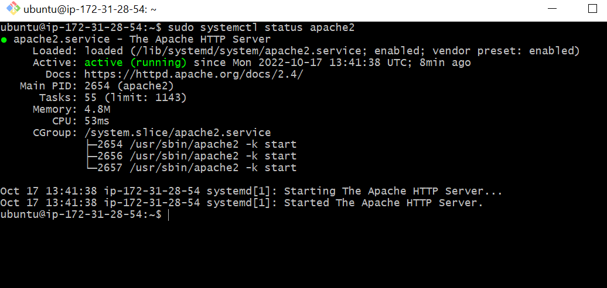

## Documentations of project1 Dario learning

`sudo apt update`

`sudo apt install apache2`

`sudo systemctl apache2`

`sudo systemctl status apache2`

[Markdownguide](https://www.markdownguide.org/cheat-sheet/)

